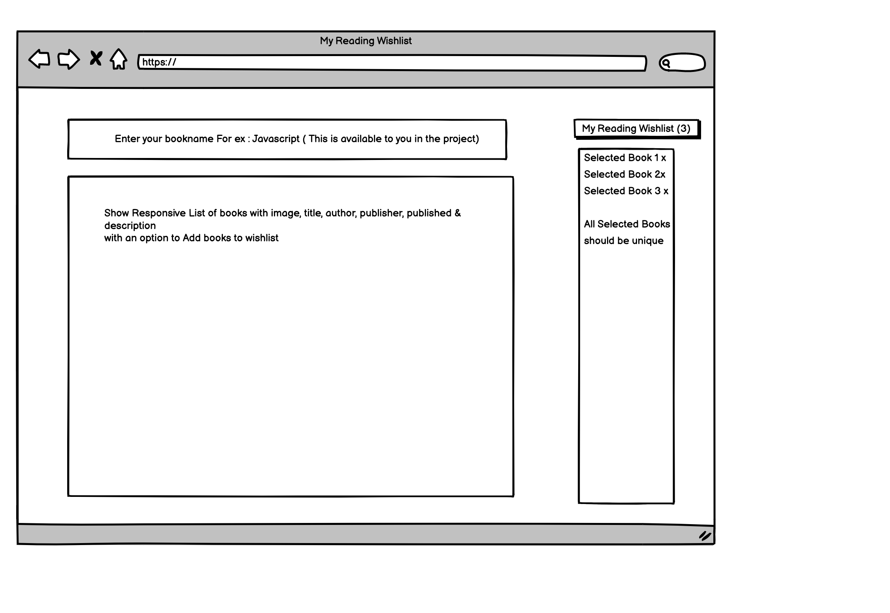

# React Exercise Repo
A sample React.js project using type script 

## Prerequisites 
To build and run the sample code please make sure you have the following prerequisites
- NodeJs >= v13.12  and <= v13.14.0
- npm/Yarn
- My development environment
- node version -  v13.14.0 & npm

## Getting Started
This repository contains a sample ReactJs application.   When launched the sample web application displays a "search" box where you can enter a book name and press ENTER. Results matching your input will be displayed as a JSON String.  
You can follow the instruction below to launch the sample application.
1. Install dependencies using `yarn`
2. Launch the web application using `yarn start` 
3. Navigate to [http://localhost:3000](http://localhost:3000)
4. You can run tests using `yarn test` 

Please feel free to make your own decisions about Web UI development. Though you are can use any UI library to build the web page, please see if you can avoid them. Also, you may use any state management technique.

### Exercise 1: Designed the web page in line with the bellow mockup.
